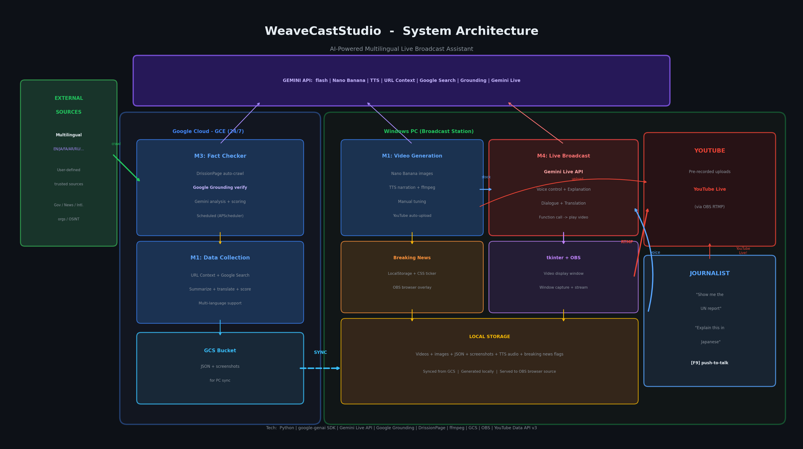

# WeaveCastStudio

**AI搭載多言語対応ライブ配信アシスタント**

WeaveCastStudio は、ジャーナリスト向けにニュース収集・ファクトチェック・動画生成・リアルタイムライブ配信支援を自動化するエンドツーエンドシステムです。
ライブ配信中にGeminiがジャーナリストの音声指示を聞き取り、映像クリップの再生・地図の表示・速報の提示/解説などの裏方作業を行う事で、ジャーナリストはライブ配信に集中できます。



## 仕組み

システムは2つの環境に分かれた4つのモジュールで構成されています。

### Google Cloud（GCE — 24時間稼働）

| モジュール | 役割 | 主要技術 |
|-----------|------|---------|
| **M1: データ収集・動画生成** | Gemini + Google Search で政府声明などを収集し、要約・ナレーション（TTS）・画像生成・ブリーフィング動画の合成を行う。YouTube へのアップロードも可能。 | Gemini 2.5 Flash, nodriver, ffmpeg, YouTube Data API v3 |
| **M3: ファクトチェッカー / クローラー** | 政府機関・国連・OSINT などの信頼できる情報源をスケジュール実行でクロールし、記事を SQLite に保存。Gemini で重要度スコアリングを行い、速報を検出する。 | DrissionPage, Gemini + Grounding, APScheduler |

### Windows PC（放送局）

| モジュール | 役割 | 主要技術 |
|-----------|------|---------|
| **M4: ライブ放送** | Gemini Live API を使った音声クライアント。ジャーナリストが F9（プッシュトーク）で話すと、Gemini が音声＋ファンクションコールで応答し、動画再生・画像表示・背景説明を行う。OBS 向け速報ティッカーオーバーレイも搭載。 | Gemini Live API, PyAudio, python-vlc, tkinter, OBS |

### データフロー

```
GCE (M1/M3)  ──→  GCS バケット  ──→  Windows PC (M4)
  cron ジョブ      gcloud rsync       pull_from_gcs.py
```

M1・M3 は cron で実行され、結果（動画・画像・JSON・SQLite DB）を GCS バケットにプッシュします。
Windows の放送局は配信前に `pull_from_gcs.py` でデータを取得します。
M4 はローカルデータを読み込み、放送中に提供します。

## 前提条件

- **Google Cloud** アカウント（課金有効化済み）
- **Gemini API キー**（`GOOGLE_API_KEY`）
- **Python 3.11+**（[uv](https://docs.astral.sh/uv/) で管理）
- **Chromium**（GCE 上の DrissionPage / nodriver 用）
- **ffmpeg**（GCE 上の動画合成用）
- **OBS Studio**（Windows でのライブ配信用）
- **Google Cloud SDK**（`gcloud`、GCE・Windows 双方に必要）

## リポジトリ構成

```
WeaveCastStudio/
├── README.md                  # ← 英語版 README
├── README_ja.md               # ← 本ファイル（日本語版）
├── .env                       # GOOGLE_API_KEY + LANGUAGE（git 管理外、全モジュール共通）
├── .env.sample                # .env のテンプレート
├── content_index.py           # 共有モジュール: M1/M3 → M4 のコンテンツレジストリ
├── pull_from_gcs.py           # Windows: GCS データをローカルに取得（content_index.json をマージ）
├── pyproject.toml             # uv プロジェクト定義
│
├── shared/                    # M1/M3 共通パイプラインモジュール
│   ├── __init__.py
│   ├── language_utils.py      # BCP-47 言語設定ローダー（.env から LANGUAGE を読み込む）
│   ├── source_collector.py    # フェーズ1: Gemini Search + nodriver
│   ├── summarizer.py          # フェーズ1: 構造化 JSON サマリー
│   ├── script_writer.py       # フェーズ2: ナレーションスクリプト
│   ├── image_generator.py     # フェーズ2: インフォグラフィック画像
│   ├── narrator.py            # フェーズ3: TTS 音声
│   └── video_composer.py      # フェーズ4: ffmpeg 動画合成
│
├── IaC/                       # GCE + GCS 向け Terraform 設定
│   ├── main.tf
│   ├── variables.tf
│   ├── startup.sh
│   ├── terraform.tfvars.example
│   └── README.md
│
├── gcp/                       # GCE デプロイガイド & 同期スクリプト
│   ├── README.md              # 英語版デプロイガイド
│   ├── README_ja.md           # 日本語版デプロイガイド
│   └── sync_to_gcs.sh         # GCE→GCS プッシュスクリプト（cron で実行）
│
├── compe_M1/                  # モジュール M1: データ収集・動画生成
│   ├── main.py                # パイプラインエントリポイント（--phase 1..5）
│   ├── requirements.txt
│   ├── README.md              # M1 詳細ドキュメント（パイプライン・コスト等）
│   ├── config/
│   │   └── topics.yaml        # トピック定義
│   └── uploader/
│       └── youtube_uploader.py   # フェーズ5: YouTube アップロード
│
├── compe_M3/                  # モジュール M3: ファクトチェッカー / クローラー
│   ├── main.py                # 統合 CLI（crawl / analyze / compose / schedule / pipeline）
│   ├── requirements_m3.txt
│   ├── config/
│   │   └── sources.yaml       # クロール対象定義（政府機関・国連・OSINT）
│   ├── crawler/
│   │   └── drission_crawler.py
│   ├── store/
│   │   └── article_store.py   # SQLite 記事ストレージ
│   ├── analyst/
│   │   ├── gemini_client.py
│   │   └── gemini_analyst.py  # 重要度スコアリング＋速報検出
│   ├── composer/
│   │   └── briefing_composer.py
│   └── scheduler/
│       └── crawl_scheduler.py
│
├── compe_M4/                  # モジュール M4: ライブ放送クライアント
│   ├── gemini_live_client.py  # メインエントリポイント
│   ├── media_window.py        # tkinter 動画・画像表示
│   ├── breaking_news_server.py# OBS ティッカー向け HTTP+SSE サーバー
│   ├── overlay/
│   │   └── ticker.html        # OBS ブラウザソース（速報表示）
│   └── OBS_SETUP.md           # OBS 設定ガイド
│
└── docs/
    └── weavecaststudio_architecture_simple.png
```

## セットアップ

### 1. GCE インフラ（M1 + M3）

**オプション A — Terraform（推奨）:**

```bash
cd IaC/
cp terraform.tfvars.example terraform.tfvars
# terraform.tfvars を編集: project_id, google_api_key 等を設定
terraform init && terraform apply
```

**オプション B — 手動:**

`gcp/README.md`（英語）または `gcp/README_ja.md`（日本語）のステップバイステップ手順に従ってください。

**インスタンス起動後:**

```bash
gcloud compute ssh weavecast-collector --zone=asia-northeast1-b

cd ~/WeaveCastStudio
uv sync

# 環境設定（プロジェクトルート — 全モジュール共通）
cp .env.sample .env
# .env を編集: GOOGLE_API_KEY と LANGUAGE を設定

# M3 動作確認
cd compe_M3 && uv run main.py crawl

# M1 動作確認
cd ../compe_M1 && uv run main.py --phase 1

# cron 設定（gcp/README.md Step 10 参照）
crontab -e
```

### 2. Windows 放送局（M4）

```powershell
# クローン & インストール
git clone https://github.com/webbigdata-jp/WeaveCastStudio.git
cd WeaveCastStudio
uv sync

# 環境設定
cp .env.sample .env
# .env を編集: GOOGLE_API_KEY と LANGUAGE を設定

# GCS からデータを取得
python pull_from_gcs.py

# OBS 設定（compe_M4/OBS_SETUP.md 参照）

# 起動
cd compe_M4
python gemini_live_client.py
```

**OBS 設定の概要:**
1. MediaWindow（tkinter）用に **ウィンドウキャプチャ** ソースを追加
2. `http://localhost:8765/overlay`（1920×1080）を指す **ブラウザ** ソースを追加
3. レイヤー順: ティッカー（最前面）→ MediaWindow → その他のソース
4. 詳細は `compe_M4/OBS_SETUP.md` を参照

### 3. データ同期（GCE → GCS → Windows）

**GCE → GCS** は `gcp/sync_to_gcs.sh` で処理します（cron または手動実行）。

**GCS → Windows:**

```bash
# 全データを取得
python pull_from_gcs.py

# M3 のみ取得
python pull_from_gcs.py --m3only

# M1 のみ取得
python pull_from_gcs.py --m1only
```

## 環境変数

| 変数 | 場所 | 説明 |
|------|------|------|
| `GOOGLE_API_KEY` | `.env`（プロジェクトルート） | Gemini API キー |
| `LANGUAGE` | `.env`（プロジェクトルート） | 出力言語の BCP-47 コード（例: `ja`, `en`, `ko`） |

全モジュール（M1・M3・M4）はプロジェクトルートの `.env`（`WeaveCastStudio/.env`）を読み込みます。

### LANGUAGE の設定

`LANGUAGE` は全モジュールの出力言語を制御する [BCP-47 言語コード](https://ai.google.dev/gemini-api/docs/live-api/capabilities#supported-languages) です。

- **Live API（M4）:** セッションの言語コードとしてそのまま渡されます（例: `ja`）。Gemini の音声認識・音声合成・システムプロンプトの言語指定に使用されます。
- **標準プロンプト（M1/M3）:** `shared/language_utils.py` が自然言語名（例: `Japanese`）に変換し、Gemini プロンプトに自動挿入します。これによりナレーションスクリプト・画像キャプション・サマリーが指定言語で生成されます。

変換テーブルは `shared/language_utils.py` 内の `_BCP47_TO_PROMPT_LANG` にあります。言語を追加する場合は BCP-47 コードと英語名を追記してください。未対応コードは `en` / `English` にフォールバックします。

```bash
# .env の例
GOOGLE_API_KEY=your_api_key_here
LANGUAGE=ja   # 日本語出力
```

#### M3 固有の言語動作

`GeminiClient` はインスタンス化時に `LANGUAGE` を解決し、`self.language`（`bcp47_code` と `prompt_lang` を持つ `LanguageConfig`）として公開します。ユーザー向けテキストを生成する M3 の全コンポーネントはこの値をクライアントから読み取るため、追加設定は不要です。

| フィールド | 言語 |
|-----------|------|
| `summary` | 出力言語（`LANGUAGE` で設定） |
| `importance_reason` | 出力言語（`LANGUAGE` で設定） |
| ブリーフィングスクリプト | 出力言語（`LANGUAGE` で設定） |
| ショートクリップスクリプト | 出力言語（`LANGUAGE` で設定） |
| `topics` | **常に英語**（一貫したダウンストリームフィルタリングのため） |
| `key_entities` | **常に英語**（一貫したダウンストリームフィルタリングのため） |
| ログメッセージ / 内部 ID | **常に英語** |

> **M3 プロンプトを専門分野向けにカスタマイズする場合:**
> `compe_M3/analyst/gemini_analyst.py` の `_ANALYSIS_PROMPT_TEMPLATE` と
> `compe_M3/composer/briefing_composer.py` の `generate_m3_script`・`_generate_short_clip_script` を編集してください。
> いずれのファイルにも `NOTE FOR MAINTAINERS` コメントブロックがあり、
> 金融・スポーツ・地域ニュースなど専門分野向けにデプロイする際の調整箇所（スコアリングガイド・トピック例・トーン）を説明しています。

YouTube アップロード（M1 フェーズ5）には OAuth2 認証情報が別途必要です。詳細は `compe_M1/README.md` を参照してください。

## トピック設定（`topics.yaml`）

各トピックエントリには2つのタイトルフィールドがあります。

| フィールド | 用途 |
|-----------|------|
| `title_en` | Gemini 検索クエリおよび内部辞書キーとして使用する英語のトピック名。 |
| `title_target_lang` | 出力言語（`LANGUAGE` で設定）での表示名。画面タイトル・ナレーションスクリプト・画像キャプションに使用する。 |

```yaml
# 例
- title_en: "Strait of Hormuz blockade"
  title_target_lang: "ホルムズ海峡封鎖"   # LANGUAGE=ja のときに出力に表示される
  query_keywords:
    - "Strait of Hormuz blockade 2026"
  importance_score: 9.0
  tags: ["hormuz", "iran", "shipping", "military"]
```

トピックを追加する際は、設定した `LANGUAGE` に合わせた表示テキストを `title_target_lang` に必ず設定してください。

## 使い方

### M1: ブリーフィング動画を生成する

```bash
# GCE 上で実行
cd compe_M1

# フェーズ単独実行
uv run main.py --phase 1          # 収集・要約
uv run main.py --phase 2          # スクリプト・画像生成
uv run main.py --phase 3          # TTS ナレーション
uv run main.py --phase 4          # 動画合成
uv run main.py --phase 5          # ContentIndex への登録

# 一括実行
uv run main.py                    # フェーズ 1〜5
uv run main.py --skip-upload      # フェーズ 1〜4 + ContentIndex のみ（YouTube アップロードなし）

# トピック切り替え
uv run main.py --phase 1 --topic-index 0   # 1番目のトピック（デフォルト）
uv run main.py --phase 1 --topic-index 1   # 2番目のトピック
```

パイプライン図とコスト試算は `compe_M1/README.md` を参照してください。

### M3: ニュースソースをクロール・分析する

```bash
# GCE 上で実行
cd compe_M3

# クロール
uv run main.py crawl                          # デフォルトソース（un_news）
uv run main.py crawl --source centcom          # 特定ソースを指定
uv run main.py crawl --all                     # 全ソース
uv run main.py crawl --list-sources            # 登録済みソースを表示

# 分析
uv run main.py analyze                         # 未分析記事を一括分析
uv run main.py analyze --limit 3               # 最大3件に制限

# ブリーフィング動画の合成
uv run main.py compose --dry-run               # スクリプトのみ（動画生成なし）
uv run main.py compose                         # 動画生成まで実行
uv run main.py compose --short-clips           # ショートクリップモード
uv run main.py compose --short-clips --limit 1 # 1クリップのみ

# スケジューラー（デーモン）
uv run main.py schedule                        # Ctrl+C まで実行
uv run main.py schedule --duration 30          # 30秒後に自動停止

# フルパイプライン（クロール → 分析 → 合成）
uv run main.py pipeline                        # ワンショット実行
uv run main.py pipeline --dry-run              # 動画生成をスキップ

# デバッグ出力
uv run main.py --debug crawl                   # DB 統計・詳細ログを表示
```

### M4: ライブ放送

```bash
# Windows 上で実行
cd compe_M4
python gemini_live_client.py
```

**放送中のキーボードショートカット:**

| キー | 操作 |
|------|------|
| F5 | 再生 / 一時停止トグル |
| F6 | 再生停止 |
| F7 | メディアウィンドウを最小化 |
| F8 | メディアウィンドウを復元 |
| **F9** | **プッシュトーク**（押しながら Gemini に話しかける） |

## 技術スタック

Python, google-genai SDK, Gemini Live API, Gemini 2.5 Flash, Google Grounding, DrissionPage, nodriver, ffmpeg, APScheduler, PyAudio, python-vlc, tkinter, OBS Studio, Terraform, GCE, GCS, YouTube Data API v3

## TODO

- [ ] **M3 プロンプトチューニング**: `gemini_analyst.py`（`_ANALYSIS_PROMPT_TEMPLATE`）と `briefing_composer.py`（`generate_m3_script`・`_generate_short_clip_script`）のデフォルトプロンプトは汎用設計になっています。金融・スポーツ・地域政治など特定の専門分野向けにデプロイする場合は、これらのファイル内のスコアリングガイド・トピック例・トーン指示を編集してください。
- [x] **GCE→GCS 同期スクリプト**: `gcp/sync_to_gcs.sh` が M1/M3 の出力と `content_index.json` を cron ベースで GCS にプッシュします。
- [x] **content_index.py ドキュメント**: スキーマリファレンスとモジュール別インテグレーションガイドは `docs/content_index.md` を参照してください。
- [ ] **CI/CD**: 自動テスト・リントの設定はまだありません。

## ライセンス

*未定*
